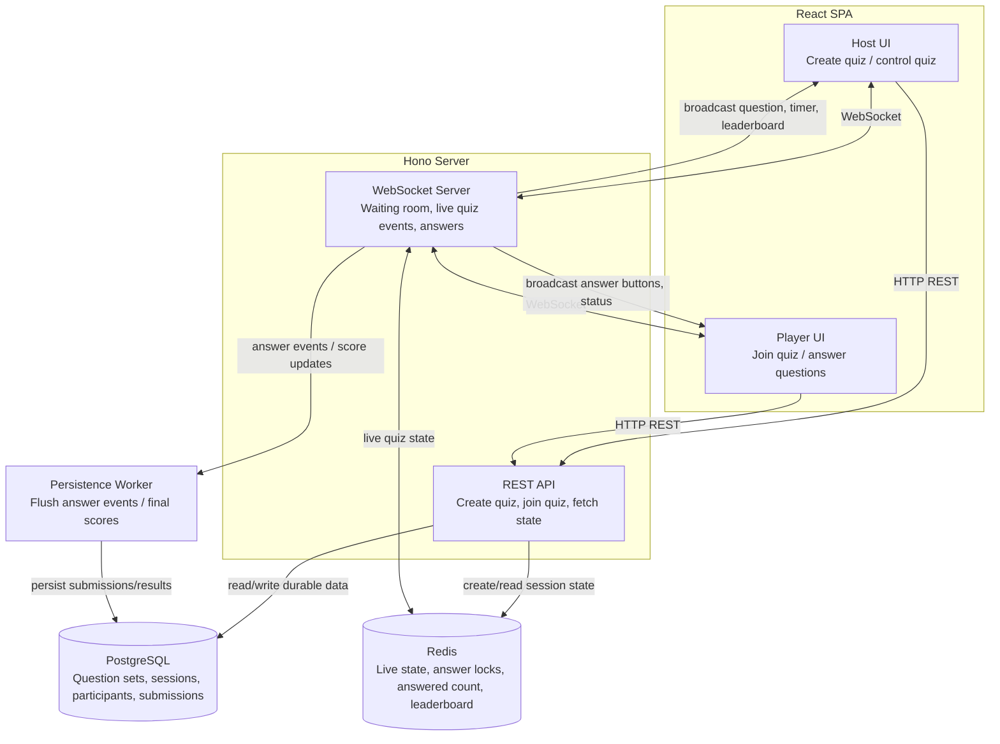

```mermaid
flowchart TD
  %% React + Hono Live Quiz System

  subgraph Client["React SPA"]
    HostUI["Host UI<br/>Create quiz / control quiz"]
    PlayerUI["Player UI<br/>Join quiz / answer questions"]
  end

  subgraph Hono["Hono Server"]
    REST["REST API<br/>Create quiz, join quiz, fetch state"]
    WSS["WebSocket Server<br/>Waiting room, live quiz events, answers"]
  end

  DB[("PostgreSQL<br/>Question sets, sessions, participants, submissions")]
  Redis[("Redis<br/>Live state, answer locks, answered count, leaderboard")]
  Worker["Persistence Worker<br/>Flush answer events / final scores"]

  HostUI -->|"HTTP REST"| REST
  PlayerUI -->|"HTTP REST"| REST

  HostUI <-->|"WebSocket"| WSS
  PlayerUI <-->|"WebSocket"| WSS

  REST -->|"read/write durable data"| DB
  REST -->|"create/read session state"| Redis

  WSS <-->|"live quiz state"| Redis
  WSS -->|"answer events / score updates"| Worker
  Worker -->|"persist submissions/results"| DB

  WSS -->|"broadcast question, timer, leaderboard"| HostUI
  WSS -->|"broadcast answer buttons, status"| PlayerUI
```
