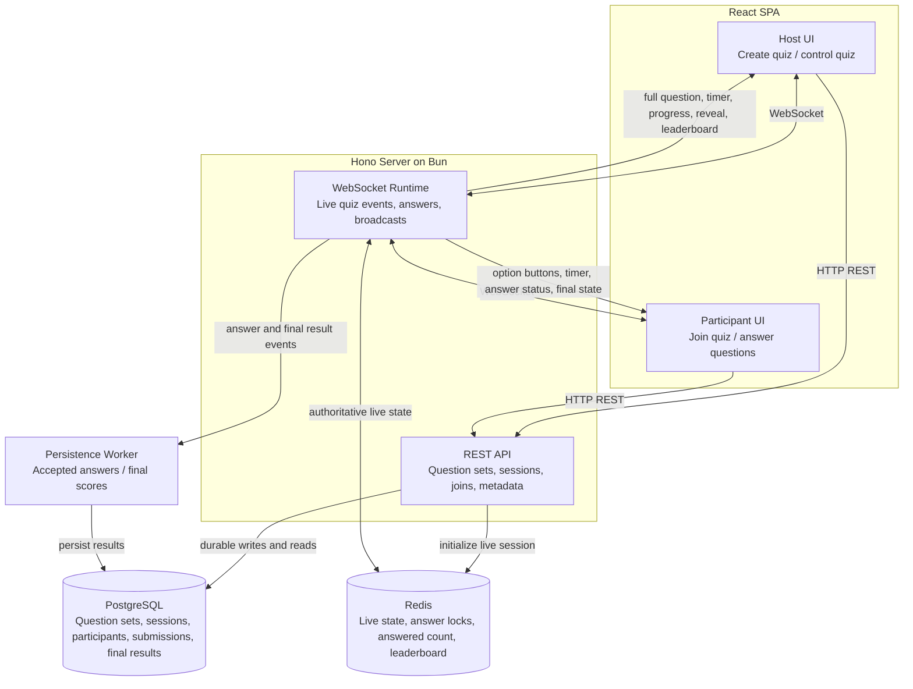

# System Design

This design supports a real-time multiple-choice quiz where a host creates a quiz session, participants join with a quiz code or link, answers are processed live, and scores are reflected on a leaderboard.

## Architecture

## Components

- React/Vite SPA: renders host creation/control screens and participant join/live screens. It stores private host and participant tokens locally for reconnect.
- Hono REST API: creates question sets, creates quiz sessions, joins participants, validates tokens, and returns host or participant metadata.
- WebSocket runtime: accepts host and participant sockets, enforces role-specific events, owns live progression, validates answers, broadcasts state, and schedules server-side question timers.
- PostgreSQL with Drizzle: stores durable quiz data: question sets, questions, answer options, sessions, participants, answer submissions, and final results.
- Redis with node-redis: stores low-latency live session state, active question metadata, answer locks, answered counts, participant leaderboard rows, and score ordering.
- Persistence worker: consumes accepted-answer and final-leaderboard events so durable writes do not block time-sensitive WebSocket broadcasts.

## Data Flow

1. The host creates a question set through REST. The server validates timers, question count, option count, and exactly one correct option per question before storing durable data.
2. The host creates a quiz session. The server generates a quiz code and private host token, stores the session in PostgreSQL, and initializes live state in Redis.
3. Participants join with the quiz code or link. REST creates participant records, returns private participant tokens, and adds participants to the live leaderboard state.
4. Host and participants connect over WebSocket. Valid tokens restore the current session view after refresh or reconnect.
5. The host starts the quiz. The WebSocket runtime sets the active question and authoritative timer in Redis, schedules expiry, and broadcasts full question text to the host but only option buttons to participants.
6. Participants submit answers. Redis answer locks reject duplicate answers, domain validation rejects late or invalid answers, and accepted answers update live scores and answered count.
7. When the server timer expires, the runtime enters reveal state, broadcasts the correct answer and top scores to the host, keeps participants in a waiting state, and queues persistence events.
8. The host advances through questions or finishes the quiz. Final leaderboard rows are read from Redis, persisted to PostgreSQL, and broadcast to clients.

## Technology Choices

- React, Vite, and TypeScript keep the client small, typed, and fast to iterate.
- Hono on Bun provides a compact TypeScript HTTP and WebSocket server for the challenge scope.
- PostgreSQL and Drizzle provide durable relational storage with typed schema and migrations.
- Redis provides low-latency live state, answer locks, counters, and sorted leaderboard behavior.
- WebSockets provide prompt live updates for quiz state, answer progress, and leaderboard changes.
- Docker Compose runs the frontend, backend, PostgreSQL, and Redis together for a production-style local demo.

## AI Collaboration in Design

I first brainstormed the product behavior and architecture with ChatGPT, then captured the rough design in [SPEC.md](../SPEC.md). That specification became the reference for breaking the work into manageable implementation tasks and for checking that the final design stayed aligned with the challenge requirements.
